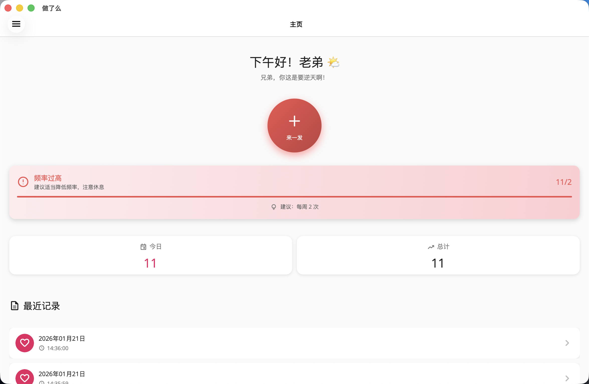
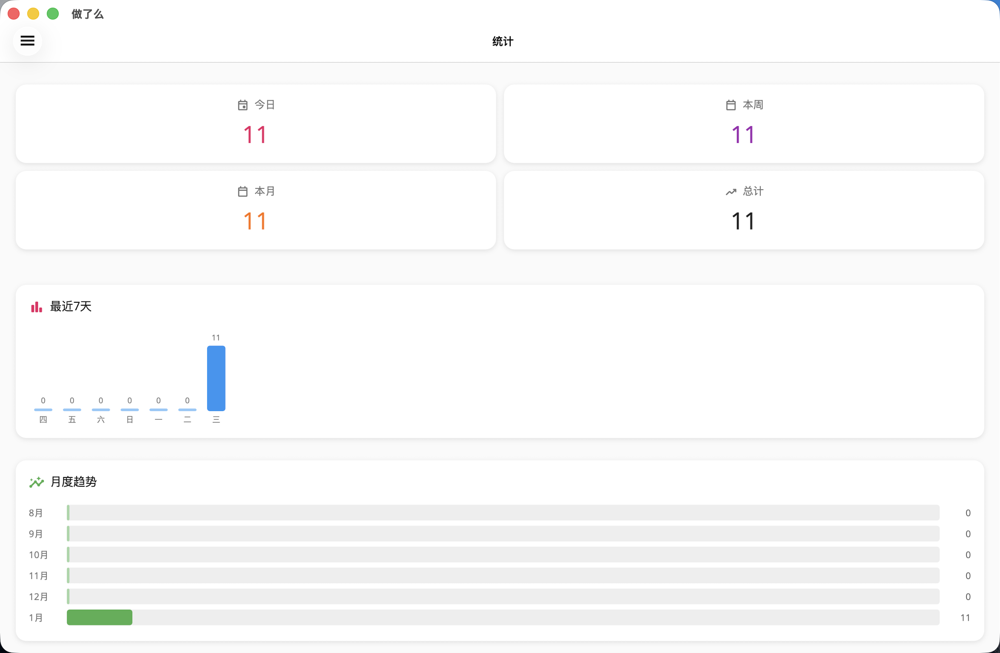
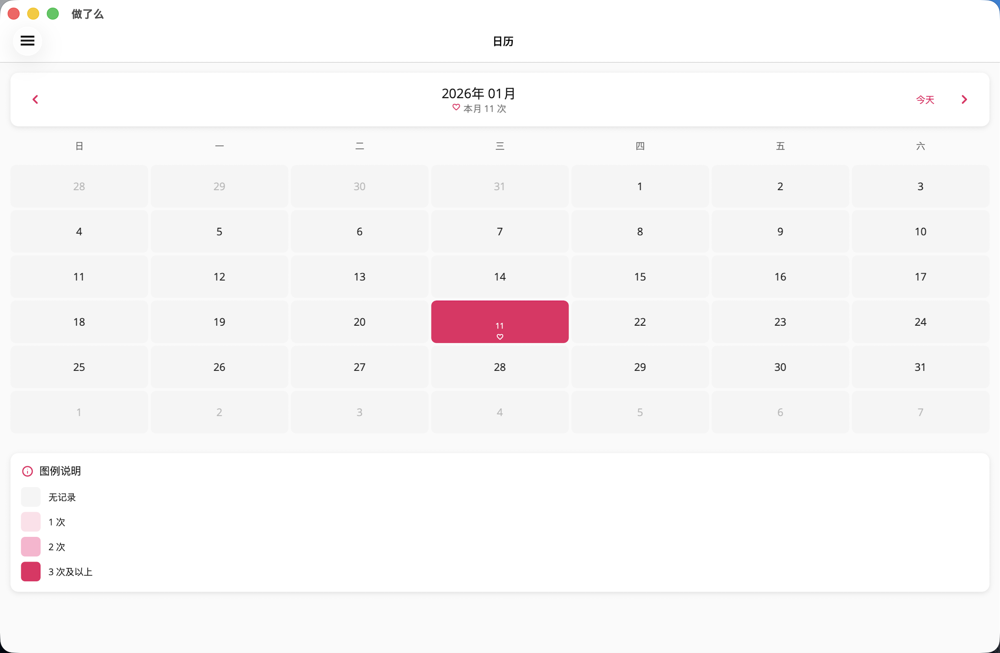
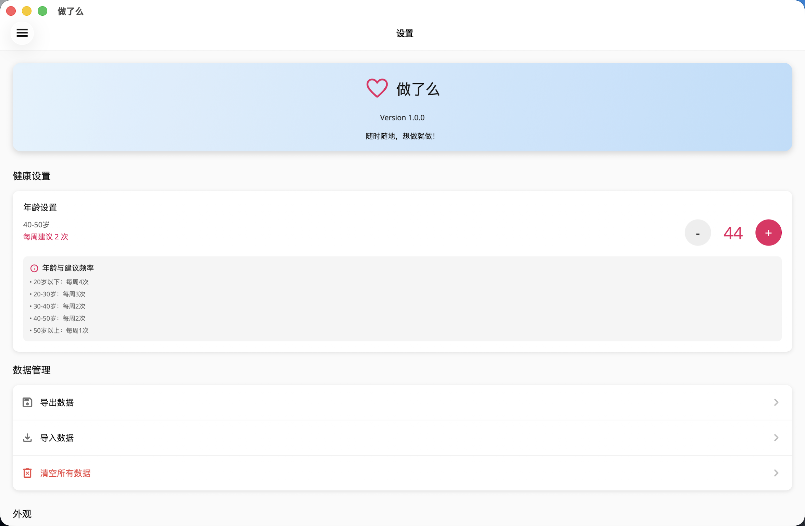
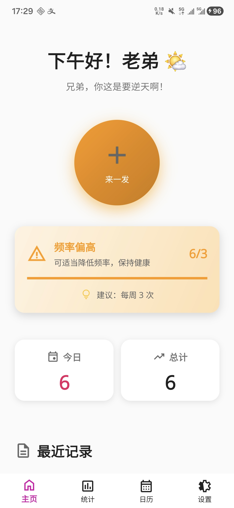
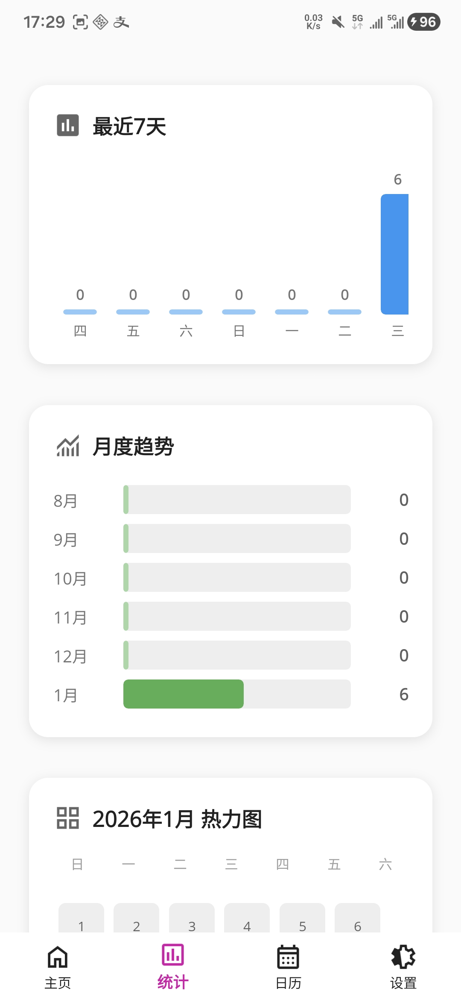
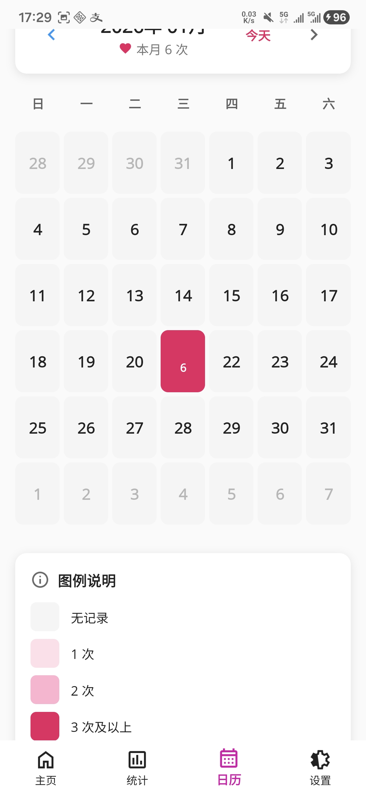
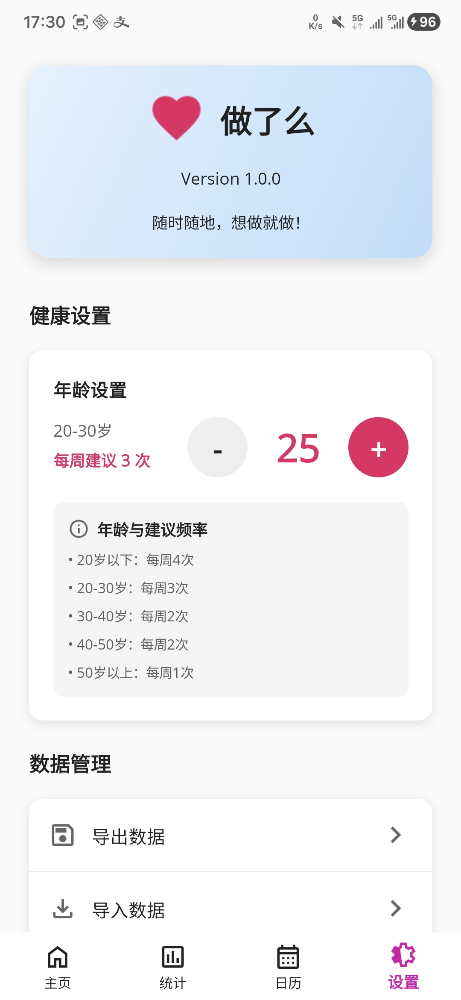

# 做了么 APP

做了么APP，支持android、ios、windows、macOS等，记录生活点滴。

## 📱 应用截图

### 🖥️ macOS 版本
<table>
  <tr>
    <td><br/><center>主页</center></td>
    <td><br/><center>统计页面</center></td>
  </tr>
  <tr>
    <td><br/><center>日历视图</center></td>
    <td><br/><center>设置页面</center></td>
  </tr>
</table>

### 🤖 Android 版本

<table>
  <tr>
    <td><br/><center>主页（Android）</center></td>
    <td><br/><center>统计（Android）</center></td>
    <td><br/><center>日历（Android）</center></td>
    <td><br/><center>设置（Android）</center></td>
  </tr>
</table>


## 功能特点

### 核心功能
-  **一键记录**：点击主按钮即可添加记录
-  **备注功能**：点击记录卡片或日历中的某一天，即可为记录添加/编辑备注
-  **统计展示**：实时显示今日、本周、本月、今年、总计数量，以及最长连续天数、平均间隔天数
- **历史记录**：查看所有记录的详细时间与备注
-  **滑动删除**：左滑记录即可删除
- **数据导出/导入**：一键导出 JSON 备份并分享，或从备份文件导入（支持合并/替换）
- **PIN 密码保护**：开启后应用启动/切回前台需输入密码解锁，密码以哈希形式存储
- **每日健康提醒**：可设置每日提醒时间，通过本地通知提醒
- **深色模式**：支持跟随系统或手动切换深色/浅色主题
- **数据持久化**：所有数据保存在本地，保护隐私
-  **现代化设计**：使用 .NET MAUI 原生控件实现的现代化设计
- **底部导航**：快速标签页，首页、统计、日历、设置，快速切换

## 技术栈

- **.NET MAUI**：微软最新的跨平台框架
- **MVVM 架构**：Model-View-ViewModel 设计模式
- **依赖注入**：使用 DI 容器管理服务
- **数据持久化**：JSON 文件存储
- **现代 UI**：Border、Shadow、RoundRectangle 等现代控件
- **Shell 导航**：使用 MAUI Shell 实现底部 TabBar 导航
- **Plugin.LocalNotification**：跨平台本地通知，用于每日健康提醒
- **SecureStorage**：系统级安全存储，用于保存密码哈希

## UI 设计亮点

### 现代化设计元素
- **阴影效果**：卡片和按钮具有精细的阴影
- **圆角设计**：所有卡片和按钮使用圆角矩形
- **Emoji 图标**：使用 Unicode Emoji 作为视觉元素
- **响应式布局**：自适应不同屏幕尺寸
- **Material 配色**：遵循 Material Design 规范的配色方案
- **底部导航栏**：便捷的页面切换体验

## 项目结构

```
zuoleme/
├── Models/              # 数据模型
│   └── Record.cs       # 记录模型
├── Services/           # 业务服务
│   └── RecordService.cs # 记录数据服务
├── ViewModels/         # 视图模型
│   └── MainViewModel.cs # 主视图模型
├── Views/              # 页面视图
│   └── HomePage.xaml   # 主页（记录）
│   └── StatsPage.xaml  # 统计页
│   └── SettingsPage.xaml # 设置页
├── AppShell.xaml       # Shell 导航定义
└── Resources/          # 资源文件
    └── Styles/         # 样式和颜色
```


## 运行要求

- **.NET 10**
- **iOS**：15.0+
- **Android**：API 21+
- **Windows**：Windows 10 (17763+)
- **macOS**：macOS 15.0+ (Catalyst)

## 构建命令

### Windows
```bash
dotnet build -f net10.0-windows10.0.19041.0
dotnet run -f net10.0-windows10.0.19041.0
```

### Android
```bash
dotnet build -f net10.0-android
dotnet run -f net10.0-android
```

### iOS
```bash
dotnet build -f net10.0-ios
dotnet run -f net10.0-ios
```

## UI 控件展示

### 使用的 .NET MAUI 控件
1. **Shell** - 应用导航和底部 TabBar
2. **TabBar** - 底部标签栏导航
3. **Border** - 带阴影和圆角的边框容器
4. **Shadow** - 阴影效果
5. **RoundRectangle** - 圆角矩形形状
6. **SwipeView** - 滑动操作视图
7. **CollectionView** - 可滚动列表
8. **Grid** - 网格布局


## 未来计划

- [x] 添加备注功能
- [x] 数据导出和导入功能
- [x] 统计图表可视化
- [x] 提醒功能（每日本地通知）
- [x] 深色模式
- [x] 密码保护隐私实现（PIN + 锁屏）
- [ ] 云同步数据选项
- [x] 更多统计维度（今年、最长连续天数、平均间隔天数）
- [x] 数据可视化（热力图、折线统计图）
- [x] 更多数据管理实现（备注编辑、日历内查看/编辑）
- [x] 使用说明页面
- [x] 版本更新记录

> **关于云同步**：本应用定位为「本地优先、隐私优先」的记录工具（详见下方隐私声明），云同步需要自建或依赖第三方后端服务，与当前架构和隐私承诺存在冲突，暂不计划实现。如未来确有需求，会以「可选、默认关闭、端到端加密」的方式单独评估。

## 技术亮点
 **🎨 .NET MAUI** - 完全基于最新 UI 框架  
**Shell 导航** - 使用 MAUI Shell 实现现代导航  
 **现代设计** - 使用最新的 MAUI 控件（Border、Shadow 等）  
 **多页架构** - 首页、统计、设置多功能分离  
 **跨平台一致** - 多平台统一的视觉体验  
 **流畅高效** - 无冗余代码，响应流畅  
 **易于维护** - 代码清晰，结构清晰  
 **MVVM 模式** - 数据绑定和命令模式  

## 隐私声明

本应用所有数据仅存储在您的设备本地，不会上传到任何服务器。开启密码保护后，密码以哈希形式存储在系统安全存储中，应用不会以明文形式保存密码。请放心添加和管理您的隐私。
